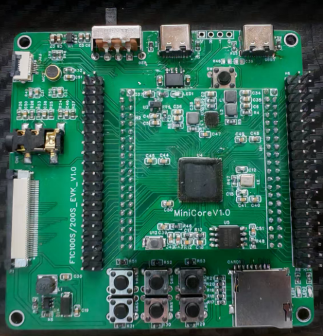

# 项目说明

项目主要是我用来学习F1C100S的学习笔记。使用的是我自己绘制的核心板和底板。板子和原理图在开源文件夹中都有01_Hardware中。F1C100S，F1C200S应该都是通用，软硬件都会开源，并且会在博客中说明在使用过程中遇到的一些问题。




# 项目参考

项目参考：https://gitee.com/dmcus/F1C200S

# 硬件设计以及初次启动

## 核心板设计

核心板的设计主要分为几个块，分别是核心板周围、Flash、电源和排针，具体的设计图纸可以去看我的原理图开源地址，这里描述几个主要的设计时候考虑的问题。

1、关于芯片周围的电路处理，基本只有电源的滤波、晶振电路、还有就是33引脚DRAM_VREF的处理。我看网上画的最小核心板，很多会把Codec那一块的外围电路做处理，但是我没有加那一部分，那块只把3V0的电源接了进去，也能正常启动，我是打算那部分电路画在底板上，但是不知道这样的处理会不会对后续音频性能有什么影响。

2、在设计完焊接板子的过程中，我遇到了如果加热久了把板子焊坏的情况，具体表现为电源部分功能正常，但是一焊接上F1C100S后，电源3.3V的输出就变成4.2V了，后面焊了一块新的板子就好了。

3、焊接板子，如果对自己的技术不是很自信的话，建议先把电源部分焊接好了，几种电源的输出用万用表测试正确了再焊接其他的芯片。为板子供电，我是直接把杜邦线剪半然后焊接到了5V电容两端。

## 底层板设计

底层板包括串口、TF卡槽、音频部分、USB、全引脚引出。具体设计直接看开源的电路图。这里描述几个主要的设计时候考虑的问题。

1、底层板焊接可以先把TF卡槽，以及底座和右边的排针焊接了，因为右边有串口，加上TF卡用USB转TTL就能够测试芯片是否焊接好能够启动与否。还有就是得要把那个5V转3V3的降压以及开关焊接了，不然TF卡那里的电源会没有。

2、有的人的镜像使用的串口1打印信息，有的镜像用的串口0。这个需要注意一下，不然你可能觉得串口没输出就是没焊好，但是可能只是在另外一个口打印了。

3、注意LCD的封装，我是买的上接的信号的屏幕，所以封装也要对应上接。

4、建议自己设计的时候，增加一个按键，按键接到SPI Flash的一个口，MISO或者MOSI，为了让Flash有程序的时候不能正常加载，能够进入到FEL模式。我这个底板设计得就只能用杜邦线拉低，虽然也能用，但是不会太方便。LC-PI-200S就是用的SPI0_MISO作为Boot引脚，也就是PC2。

## 启动验证

可以使用Win32diskimager烧写，烧写的镜像，可以是LC-PI-200S的固件。可以看他们的官方Wiki怎么获取固件。里面有怎么烧写代码到SD卡和Flash中。

http://wiki.lcmaker.com/index.php?title=LC-PI-200S

通过网盘分享的文件：LC-PI-200S
链接: https://pan.baidu.com/s/1Ucm_6Tpq0NpF6FSr1aHCQQ 提取码: 2bwd 
--来自百度网盘超级会员v6的分享

两种方式，建议先用SD卡，免得Flash烧了后没有没办法进入FEL模式。

# 裸机学习

这部分的内容，使用的驱动和编译工具，是下面这个开源项目，感谢大佬开源。该开源代码写的工具会自动给 bin 文件添加头。

https://gitee.com/dmcus/F1C200S

## 开源项目分析

这个开源项目的bootloader会把boot的代码加载到SRAM，然后bootloader启动起来后，会初始化DDR和SPI Flash，然后把Flash中应用区的代码加载到DRAM（DDR）中，进行运行。

下载程序他是用的xfel进行下载，这个工具可以让芯片处于fel模式的时候烧写程序到Flash中。具体的软件工具下载地址看他开源readme。然后下载好下载工具后，需要把这个工具路径放到系统环境变量。可以用下面的命令检查是否安装成功。

```bash
xfel version
```

其他的工具看他的readme吧，其实主要就3个，arm-gcc工具编译代码，mingw64处理makefile，xfel下载程序。

